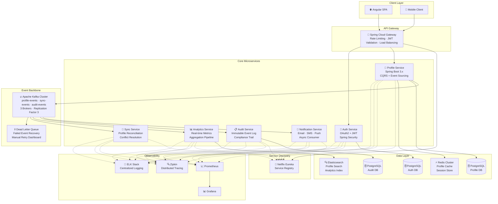

<div align="center">

<!-- ╔══════════════════════════════════════════════════════════╗ -->
<!--   ANIMATED HEADER BANNER (capsule-render waving + fadeIn)   -->
<!-- ╚══════════════════════════════════════════════════════════╝ -->


<!-- Live Counters -->
<p>
  
  &nbsp;
  
  &nbsp;
  
  &nbsp;
  
</p>

</div>

<!-- ╔══════════════════════════════════════════════════════════╗ -->
<!--             ANIMATED TYPING SVG  (no emojis in URL)         -->
<!-- ╚══════════════════════════════════════════════════════════╝ -->

<div align="center">

</div>

---

<!-- ╔══════════════════════════════════════════════════════════╗ -->
<!--                     CONTACT BADGES                          -->
<!-- ╚══════════════════════════════════════════════════════════╝ -->

<div align="center">

[](mailto:kirantilekar@icloud.com)
[](https://linkedin.com/in/kiran-tilekar-94173382)
[](https://github.com/Kt129673)
[](https://wa.me/919834882015)
[]()

</div>

<br/>

<!-- ╔══════════════════════════════════════════════════════════╗ -->
<!--                   IMPROVED ABOUT ME                         -->
<!-- ╚══════════════════════════════════════════════════════════╝ -->

<table>
<tr>
<td width="58%" valign="top">

## 🧑‍💻 About Me

> 🏗️ I don't just write code — I **architect distributed systems that run governments and enterprises**.
> With **3.3+ years** of engineering mission-critical applications using
> **Spring Boot 3.x, Apache Kafka, and Event-Driven Microservices**, I've built platforms processing
> **Rs. 156 Cr+** in government transactions at **99.95% uptime**, orchestrating
> **2M+ Kafka events/day** across **8 microservices** — with zero data loss and **sub-150ms P99 latency**.

```java
/**
 * @author   Kiran Tilekar
 * @since    Nov 2022 (AVICS, Pune)
 * @version  3.3+ Years Enterprise Java · Distributed Systems
 * @linkedin kiran-tilekar-94173382
 * @email    kirantilekar@icloud.com
 * @status   IMMEDIATE JOINER ✅
 */
@Component
@Profile("production")
public class KiranTilekar implements DistributedSystemsArchitect {

    // ── Identity ──────────────────────────────────────
    final String name     = "Kiran Tilekar";
    final String role     = "Java Backend Architect";
    final String domain   = "Distributed Systems · Event-Driven Microservices";
    final String company  = "AVICS, Pune (100% Remote)";
    final String location = "Pune, India";
    final boolean open    = true; // reach out!

    // ── Real-World Impact ─────────────────────────────
    final String revenue      = "Rs. 156 Cr+ Govt Transactions / Year";
    final String uptime       = "99.95% SLA across 8 Microservices";
    final String latency      = "Sub-150ms P99 End-to-End Latency";
    final String kafkaEvents  = "2M+ Kafka events processed / day";
    final String iot          = "10K+ sensor readings/min from 50+ machines";
    final String cicd         = "Deployments: 1 hour → 10 minutes (CI/CD)";
    final String savings      = "30+ hrs/week saved via JasperReports";
    final String coverage     = "85%+ TDD code coverage (JUnit5 + Mockito)";
    final String team         = "Led 5 devs, mentored 3 junior → mid-level";

    // ── Superpower ────────────────────────────────────
    @Override
    public String getStrength() {
        return "Event-Driven Microservices at Enterprise Scale";
    }

    // ── Ask Me About ──────────────────────────────────
    public String[] expertise() {
        return new String[]{
            "Spring Boot 3.x", "Apache Kafka", "Spring Cloud",
            "CQRS + Event Sourcing", "Saga Pattern", "DDD",
            "Resilience4j", "API Gateway", "Docker Compose",
            "Redis + Caffeine", "PostgreSQL", "gRPC",
            "Prometheus + Grafana", "Distributed Tracing",
            "Angular 14/16", "JVM Tuning", "MQTT + IoT"
        };
    }

    // ── Currently ─────────────────────────────────────
    String building = "Async Profile Sync Platform (Kafka + CQRS)";
    String reading  = "Designing Data-Intensive Applications";
    String focus    = "Event-Driven Architecture at Scale";
}
```

</td>
<td width="42%" align="center" valign="top">

<br/><br/>


<br/><br/>

**⚡ Quick Facts**

| | |
|:---:|:---|
| 💼 | **3.3+ Years** Enterprise Java |
| 🏛️ | **Rs. 156 Cr+** Systems Live |
| 🟢 | **99.95% Uptime** across Services |
| 🔥 | **2M+ Kafka Events/Day** Processed |
| ☁️ | **AWS** · Docker · Docker Compose |
| 🏗️ | **8 Microservices** in Production |
| 👥 | Led a team of **5 developers** |
| 📍 | **Pune, India** — Remote Ready |
| 🎓 | B.E. Electrical Engineering |
| 🚀 | **Immediate Joiner** |

<br/>


<br/>

**🌐 Languages Spoken**

`🇬🇧 English` &nbsp; `🇮🇳 Hindi` &nbsp; `🟠 Marathi`

<br/>

**🏷️ Core Strengths**


</td>
</tr>
</table>

<!-- Animated Divider -->


---

<!-- ╔══════════════════════════════════════════════════════════╗ -->
<!--            🏗️ ARCHITECTURE PATTERNS I BUILD WITH            -->
<!-- ╚══════════════════════════════════════════════════════════╝ -->

## 🏗️ Architecture Patterns I Build With

<div align="center">

```
╔══════════════════════════════════════════════════════════════════════════╗
║                        ARCHITECTURE DNA                                 ║
╠═══════════════════╦═══════════════════╦═══════════════════╦═════════════╣
║   Event-Driven    ║       CQRS        ║   Saga Pattern    ║     DDD     ║
║   Architecture    ║  Command / Query  ║  Orchestration +  ║  Bounded    ║
║   Kafka + Async   ║   Separation      ║  Choreography     ║  Contexts   ║
╠═══════════════════╬═══════════════════╬═══════════════════╬═════════════╣
║    API Gateway    ║  Circuit Breaker  ║   Database Per    ║    Event    ║
║     Pattern       ║   Resilience4j    ║    Service        ║   Sourcing  ║
║  Spring Cloud GW  ║  Retry + Fallback ║  Data Isolation   ║  Immutable  ║
╠═══════════════════╬═══════════════════╬═══════════════════╬═════════════╣
║    Strangler      ║    Bulkhead       ║     Outbox        ║   Retry +   ║
║    Fig Pattern    ║    Pattern        ║     Pattern       ║   Backoff   ║
║  Mono → Micro     ║  Thread Isolation ║  Transactional    ║  Exponential║
╚═══════════════════╩═══════════════════╩═══════════════════╩═════════════╝
```

<br/>


</div>

<!-- Animated wave separator -->


---

<!-- ╔══════════════════════════════════════════════════════════╗ -->
<!--      🔄 MICROSERVICES — PROFILE SYNC PLATFORM               -->
<!-- ╚══════════════════════════════════════════════════════════╝ -->

## 🔄 Microservices Architecture — Profile Sync Platform

> **Event-Driven Profile Synchronization Platform** — A production-grade microservices system
> demonstrating **CQRS, Event Sourcing, Saga Pattern, and Async Processing** with Apache Kafka.
> Each service owns its data, communicates via domain events, and scales independently.

<div align="center">



</div>

<br/>

<div align="center">


</div>

<!-- Animated shark divider -->


---

<!-- ╔══════════════════════════════════════════════════════════╗ -->
<!--       🔥 KAFKA & ASYNC — EVENT-DRIVEN SHOWCASE              -->
<!-- ╚══════════════════════════════════════════════════════════╝ -->

## 🔥 Kafka & Async Event-Driven Architecture — Real Code

> Production patterns I implement daily — **not tutorials, real enterprise code**.

<table>
<tr>
<td width="50%" valign="top">

### ⚡ Kafka Producer — Profile Change Events

```java
@Service
@RequiredArgsConstructor
@Slf4j
public class ProfileEventProducer {

    private final KafkaTemplate<String, ProfileEvent> kafkaTemplate;

    @Transactional
    public CompletableFuture<SendResult<String, ProfileEvent>>
            publishProfileChanged(ProfileDTO profile) {

        ProfileEvent event = ProfileEvent.builder()
            .eventId(UUID.randomUUID().toString())
            .eventType(EventType.PROFILE_UPDATED)
            .aggregateId(profile.getUserId())
            .payload(profile)
            .timestamp(Instant.now())
            .version(profile.getVersion())
            .build();

        return kafkaTemplate
            .send("profile-events", profile.getUserId(), event)
            .whenComplete((result, ex) -> {
                if (ex == null) {
                    log.info("Event published: partition={}, offset={}",
                        result.getRecordMetadata().partition(),
                        result.getRecordMetadata().offset());
                } else {
                    log.error("Failed to publish event for user={}",
                        profile.getUserId(), ex);
                    // Outbox pattern fallback
                    outboxRepository.save(new OutboxEntry(event));
                }
            });
    }
}
```

</td>
<td width="50%" valign="top">

### 🎧 Kafka Consumer — Async Profile Sync

```java
@Service
@RequiredArgsConstructor
@Slf4j
public class ProfileSyncConsumer {

    private final ProfileSyncService syncService;
    private final MeterRegistry meterRegistry;

    @KafkaListener(
        topics = "profile-events",
        groupId = "profile-sync-group",
        containerFactory = "kafkaConcurrentFactory"
    )
    @Retryable(
        maxAttempts = 3,
        backoff = @Backoff(
            delay = 1000, multiplier = 2.0, maxDelay = 10000
        )
    )
    public void onProfileEvent(
            @Payload ProfileEvent event,
            @Header(KafkaHeaders.RECEIVED_PARTITION) int partition,
            @Header(KafkaHeaders.OFFSET) long offset,
            Acknowledgment ack) {

        String traceId = MDC.get("traceId");
        log.info("[{}] Processing event: type={}, partition={}, offset={}",
            traceId, event.getEventType(), partition, offset);

        try {
            syncService.reconcileProfile(event);
            ack.acknowledge(); // Manual commit
            meterRegistry.counter("kafka.events.processed",
                "type", event.getEventType().name()).increment();
        } catch (Exception ex) {
            log.error("[{}] Failed — routing to DLQ", traceId, ex);
            meterRegistry.counter("kafka.events.failed").increment();
            throw ex; // Triggers DLQ via ErrorHandler
        }
    }

    // ── Dead Letter Queue Recovery ────────────────────
    @KafkaListener(topics = "profile-events.DLT",
                   groupId = "profile-dlq-group")
    public void onDeadLetterEvent(ProfileEvent event) {
        log.warn("DLQ received: eventId={}, userId={}",
            event.getEventId(), event.getAggregateId());
        alertService.notifyOps(event);
    }
}
```

</td>
</tr>
<tr>
<td width="50%" valign="top">

### 🔄 Saga Orchestrator — Distributed Transactions

```java
@Service
@RequiredArgsConstructor
@Slf4j
public class ProfileUpdateSaga {

    private final ProfileService profileService;
    private final NotificationService notificationService;
    private final AuditService auditService;
    private final SagaStateRepository sagaRepo;

    @Transactional
    public SagaResult executeProfileUpdate(ProfileCommand cmd) {

        SagaState saga = SagaState.initiate(cmd.getSagaId());

        try {
            // Step 1: Update Profile (Command side — CQRS)
            saga.markStep("PROFILE_UPDATE", StepStatus.RUNNING);
            ProfileDTO updated = profileService.updateProfile(cmd);
            saga.markStep("PROFILE_UPDATE", StepStatus.COMPLETED);

            // Step 2: Sync to Read Model (Query side — CQRS)
            saga.markStep("READ_MODEL_SYNC", StepStatus.RUNNING);
            profileService.syncReadModel(updated);
            saga.markStep("READ_MODEL_SYNC", StepStatus.COMPLETED);

            // Step 3: Send Notification (Async via Kafka)
            saga.markStep("NOTIFICATION", StepStatus.RUNNING);
            notificationService.queueProfileUpdateNotification(updated);
            saga.markStep("NOTIFICATION", StepStatus.COMPLETED);

            // Step 4: Audit Trail (Immutable Event Log)
            auditService.logProfileChange(cmd, updated);

            saga.complete();
            return SagaResult.success(saga);

        } catch (Exception ex) {
            log.error("Saga failed at step: {}", saga.getCurrentStep(), ex);
            compensate(saga, cmd); // Rollback completed steps
            return SagaResult.failed(saga, ex.getMessage());
        } finally {
            sagaRepo.save(saga);
        }
    }

    private void compensate(SagaState saga, ProfileCommand cmd) {
        saga.getCompletedSteps().descendingIterator()
            .forEachRemaining(step -> {
                log.info("Compensating step: {}", step);
                compensationRegistry.compensate(step, cmd);
            });
    }
}
```

</td>
<td width="50%" valign="top">

### ⚙️ Kafka + Async Configuration

```java
@Configuration
@EnableKafka
@EnableAsync
public class KafkaAsyncConfig {

    @Bean
    public NewTopic profileEventsTopic() {
        return TopicBuilder.name("profile-events")
            .partitions(6)
            .replicas(3)
            .config(TopicConfig.RETENTION_MS_CONFIG, "604800000") // 7 days
            .config(TopicConfig.MIN_IN_SYNC_REPLICAS_CONFIG, "2")
            .build();
    }

    @Bean
    public NewTopic deadLetterTopic() {
        return TopicBuilder.name("profile-events.DLT")
            .partitions(3)
            .replicas(3)
            .build();
    }

    @Bean
    public ConcurrentKafkaListenerContainerFactory<String, ProfileEvent>
            kafkaConcurrentFactory(ConsumerFactory<String, ProfileEvent> cf) {
        var factory = new ConcurrentKafkaListenerContainerFactory
                                    <String, ProfileEvent>();
        factory.setConsumerFactory(cf);
        factory.setConcurrency(3);
        factory.getContainerProperties()
            .setAckMode(ContainerProperties.AckMode.MANUAL);
        factory.setCommonErrorHandler(
            new DefaultErrorHandler(
                new DeadLetterPublishingRecoverer(kafkaTemplate()),
                new FixedBackOff(1000L, 3L)
            )
        );
        return factory;
    }

    @Bean
    public TaskExecutor asyncTaskExecutor() {
        ThreadPoolTaskExecutor executor = new ThreadPoolTaskExecutor();
        executor.setCorePoolSize(10);
        executor.setMaxPoolSize(50);
        executor.setQueueCapacity(200);
        executor.setThreadNamePrefix("async-profile-sync-");
        executor.setRejectedExecutionHandler(
            new ThreadPoolExecutor.CallerRunsPolicy()
        );
        executor.setWaitForTasksToCompleteOnShutdown(true);
        executor.setAwaitTerminationSeconds(30);
        executor.initialize();
        return executor;
    }
}
```

</td>
</tr>
</table>

<!-- Animated divider -->


---

<!-- ╔══════════════════════════════════════════════════════════╗ -->
<!--          🧠 SYSTEM DESIGN — SEQUENCE DIAGRAM                -->
<!-- ╚══════════════════════════════════════════════════════════╝ -->

## 🧠 System Design — How a Profile Update Flows

> End-to-end request lifecycle through the microservices mesh — from client click to eventual consistency.

```mermaid
sequenceDiagram
    participant C as 🌐 Client
    participant GW as 🚪 API Gateway
    participant PS as 👤 Profile Service
    participant DB as 🗄️ PostgreSQL
    participant RD as ⚡ Redis Cache
    participant KF as 🔥 Kafka
    participant SS as 🔄 Sync Service
    participant NS as 📧 Notification Service
    participant AS as 📋 Audit Service
    participant DLQ as 💀 Dead Letter Queue

    C->>GW: PUT /api/v1/profiles/{id}
    GW->>GW: JWT Validation + Rate Limiting
    GW->>PS: Forward (Circuit Breaker Protected)

    rect rgb(27, 67, 50)
        Note over PS,DB: CQRS — Command Side
        PS->>DB: BEGIN TRANSACTION
        PS->>DB: UPDATE profile SET ...
        PS->>DB: INSERT INTO outbox_events (...)
        PS->>DB: COMMIT
    end

    PS->>RD: Invalidate Cache (profile:{id})
    PS-->>GW: 200 OK (Updated Profile)
    GW-->>C: 200 OK

    rect rgb(13, 27, 42)
        Note over PS,KF: Async Event Publishing
        PS--)KF: ProfileUpdatedEvent (partition by userId)
    end

    par Async Consumers (Independent)
        KF--)SS: Sync to Read Model
        SS->>RD: Update Materialized View
        Note over SS: Eventual Consistency ✅
    and
        KF--)NS: Send Notification
        NS->>NS: Email + SMS + Push
        Note over NS: Async — Non-Blocking ✅
    and
        KF--)AS: Audit Log Entry
        AS->>AS: Immutable Event Store
        Note over AS: Compliance Trail ✅
    end

    alt Consumer Failure
        KF--)DLQ: Route to Dead Letter Queue
        Note over DLQ: Ops Alert + Manual Retry
    end
```

<div align="center">



</div>

<!-- Animated egg divider -->


---

<!-- ╔══════════════════════════════════════════════════════════╗ -->
<!--                    IMPACT DASHBOARD                         -->
<!-- ╚══════════════════════════════════════════════════════════╝ -->

## 🚀 Real-World Impact — By the Numbers

<div align="center">

| Metric | Achievement | Impact |
|:---:|:---:|:---:|
| 💰 Revenue Managed | **Rs. 156 Cr+ / year** | 15 Govt. Departments |
| 🟢 Service Mesh Uptime | **99.95% SLA** | Across 8 Microservices |
| 🔥 Kafka Throughput | **2M+ events / day** | Zero Data Loss |
| ⚡ P99 Latency | **Sub 150ms** | End-to-End Across Services |
| 🔍 Distributed Tracing | **100% Traceability** | Zipkin + Correlation IDs |
| 📡 IoT Throughput | **10,000+ readings / min** | 50+ Factory Machines |
| 🗄️ DB Load Reduced | **40% fewer hits** | Redis + Caffeine Caching |
| 🔄 Query Speed | **60% faster SQL** | Advanced Indexing + Cache |
| 🚢 Deploy Pipeline | **1 hr → 10 mins** | Jenkins + GitHub Actions |
| 🧪 Code Coverage | **85%+** | JUnit 5 + Mockito (TDD) |
| 📝 Report Automation | **30+ hrs/week saved** | 20+ JasperReport Templates |
| 👥 Team Leadership | **5 Developers Led** | 3 Junior → Mid-level Devs |

</div>

<!-- Animated shark divider -->


---

<!-- ╔══════════════════════════════════════════════════════════╗ -->
<!--                   CAREER TIMELINE                           -->
<!-- ╚══════════════════════════════════════════════════════════╝ -->

## 📅 Career Timeline

```
▶ 2012 ──── B.E. Electrical Engineering @ Sinhgad College of Engineering, Pune
             └─ Power Systems • Industrial Automation • Control Systems

▶ 2018 ──── QA Engineer @ Schneider Electric, Ahmednagar
             └─ Medium Voltage Systems | 95%+ First-Time Pass Rate
             └─ 8D Problem-Solving | 3 International Product Certifications

▶ 2022 ──── Java Full Stack Certification @ Seed Infotech Pvt. Ltd.
             └─ Java 17 • Spring Boot • Angular • Enterprise Architecture

▶ Nov 2022 ─ Senior Software Developer @ AVICS, Pune (100% Remote)
             ├─ 2023: ZP Work Management System ............. Rs. 156 Cr+/yr
             ├─ 2023: Government Cashbook App .............. Rs. 100 Cr/day
             ├─ 2024: Online Examination Portal ............. 1000+ students
             ├─ 2024: IoT Data Platform ................... 10K+ readings/min
             ├─ 2024: Ground Booking System .............. Rs. 10 Lakhs/month
             ├─ 2022: ITI Inventory System ................... 5000+ items
             └─ 2025: Profile Sync Platform ............. 2M+ Kafka events/day

▶ 2026 ──── Open To Exciting New Opportunities! ✅
             └─ Microservices • Kafka • Event-Driven • Cloud-Native
```

<!-- Animated wave separator -->


---

<!-- ╔══════════════════════════════════════════════════════════╗ -->
<!--                  CURRENTLY SECTION                          -->
<!-- ╚══════════════════════════════════════════════════════════╝ -->

## ⚡ Currently

<table>
<tr>
<td width="60%">

| Status | Activity |
|:---:|:---|
| 🔭 | **Architecting event-driven microservices** with Spring Cloud + Kafka |
| 🌱 | **Implementing CQRS + Event Sourcing** in production systems |
| 💡 | **Building async data pipelines** with Kafka Streams + Spring Cloud Stream |
| 🏗️ | **Designing** distributed transactions with **Saga Pattern** orchestration |
| 🤝 | Open to **Full-time Roles**, Freelance and Tech Consulting |
| 📖 | Reading: *Designing Data-Intensive Applications* — Martin Kleppmann |
| 🎯 | Shipping **Profile Sync Platform** — production-grade microservices showcase |
| 🤖 | Using **GitHub Copilot + Antigravity** to accelerate delivery |

</td>
<td align="center" width="40%">


<br/>


</td>
</tr>
</table>

<!-- Animated divider -->


---

<!-- ╔══════════════════════════════════════════════════════════╗ -->
<!--                   FEATURED PROJECTS                         -->
<!-- ╚══════════════════════════════════════════════════════════╝ -->

## 🗂️ Featured Projects

<table>
<tr>
<td width="50%" valign="top">

### 🔄 Profile Sync Microservices Platform
**Event-Driven Architecture Showcase** · `2025 – Present`

> Production-grade microservices platform with **CQRS, Event Sourcing, and Saga orchestration** — processing **2M+ Kafka events/day** with zero data loss.

- 🔥 8 independently deployable microservices
- 📨 Apache Kafka event backbone (6 partitions, RF=3)
- 🔄 CQRS with separate Command/Query models
- 💀 Dead Letter Queue with automated recovery
- 🔍 Distributed tracing with Zipkin + Correlation IDs
- 🐳 Docker Compose multi-container orchestration
- 📊 Prometheus + Grafana real-time dashboards


</td>
<td width="50%" valign="top">

### 🏛️ ZP Work Management & Financial System
**Maharashtra Zilla Parishad** · `2023 – 2026`

> Enterprise platform managing Rs. 156 Cr+ across 15 govt. departments — migrated from monolith to event-driven architecture.

- 📊 Live budget dashboard tracking Rs. 25+ Cr/year spending
- ✅ Multi-level approval system with digital signatures
- 📋 20+ auto-generated statutory reports (JasperReports)
- 🔍 60% faster queries via indexing + Redis caching
- 📡 Real-time monitoring with Prometheus + Grafana
- 🔄 Event-driven notifications via Kafka producers


</td>
</tr>
<tr>
<td width="50%" valign="top">

### 🏦 Government Cashbook Application
**Digital Accounting Ledger** · `2023 – 2024`

> Scalable cashbook managing Rs. 100+ Cr daily with full audit trail, bank sync, and async reconciliation via Kafka.

- 🏦 Live bank sync: cheque tracking + receipt generation
- 👥 200+ concurrent govt. users; high availability architecture
- 🔄 100% automated daily balance reconciliation
- 🔏 Multi-level payment approval + digital signature
- 📅 Month-end auto-closing & balance forward
- 📨 Async audit logging via Kafka event streams


</td>
<td width="50%" valign="top">

### 📡 IoT Data Collection & Analytics Platform
**Industrial Monitoring Suite** · `2024 – 2026`

> Event-driven IoT system collecting real-time sensor data from 50+ industrial machines with Kafka-based ingestion pipeline.

- ⚡ 10,000+ sensor readings/min — zero data loss
- 🗃️ PostgreSQL + InfluxDB dual-DB: 70% fewer DB calls
- 🔥 Kafka ingestion pipeline for high-throughput streaming
- 💾 50% storage savings via automated data cleanup rules
- 🖥️ NSIS Windows installer for on-site deployments
- 📈 Historical trend analysis + MQTT industrial protocols


</td>
</tr>
<tr>
<td width="50%" valign="top">

### 📝 Online Examination Portal
**High-Concurrency Assessment Platform** · `2024 – 2026`

> Enterprise exam platform supporting 1,000+ simultaneous students with live proctoring and real-time WebSocket sync.

- 👨‍🎓 1000+ concurrent students via WebSocket live sync
- 📚 10,000+ question bank with unique randomized papers
- 👁️ Real-time proctoring + anti-cheating enforcement
- 📧 Bulk upload + automated email credential delivery
- 🏅 QR-code verified digital certificate generation


</td>
<td width="50%" valign="top">

### 🏟️ Ground Booking Management System
**Sports Facility Revenue Platform** · `2024 – 2025`

> Multi-ground booking system earning Rs. 10+ Lakhs/month with flexible dynamic pricing and payment integration.

- 💰 Rs. 10+ Lakhs/month revenue across 20+ grounds
- 💳 Cash, UPI, Razorpay integration + loyalty program
- 🔁 Slot overlap detection, auto reminders, repeat bookings
- 📈 Peak/off-peak pricing, holiday & seasonal rates
- 🏆 Tournament bracket creation + team registration


</td>
</tr>
</table>

<!-- Animated egg divider -->


---

<!-- ╔══════════════════════════════════════════════════════════╗ -->
<!--                     TECH STACK                              -->
<!-- ╚══════════════════════════════════════════════════════════╝ -->

## 🛠️ Tech Stack & Tools

<div align="center">

**⚙️ Backend & Frameworks**
<br/>


**🏗️ Microservices & Cloud**
<br/>


**🎨 Frontend & UI**
<br/>


**🗄️ Databases & Caching**
<br/>


**☁️ DevOps & CI/CD**
<br/>


**🔧 Tools & Monitoring**
<br/>


</div>

---

<!-- Full Badge Wall -->
## 🏷️ Full Skill Set

<div align="center">

**Core Backend & Microservices**


**Event Streaming & Messaging**


**Resilience & Service Mesh**


**Containerization**


**Frontend**


**Databases & Caching**


**Cloud & DevOps**


**Observability & Distributed Tracing**


**Security & API**


**Testing & Reporting**


**Build Tools**


</div>

<!-- Animated slice divider -->


---

<!-- ╔══════════════════════════════════════════════════════════╗ -->
<!--                     GITHUB STATS                            -->
<!-- ╚══════════════════════════════════════════════════════════╝ -->

## 📊 GitHub Stats

<div align="center">
  
  
</div>

<div align="center">
  
</div>

---

<!-- ╔══════════════════════════════════════════════════════════╗ -->
<!--                    GITHUB TROPHIES                          -->
<!-- ╚══════════════════════════════════════════════════════════╝ -->

## 🏆 GitHub Trophies

<div align="center">
  
</div>

<!-- Animated cylinder divider -->


---

<!-- ╔══════════════════════════════════════════════════════════╗ -->
<!--               DEV PHILOSOPHY SECTION                        -->
<!-- ╚══════════════════════════════════════════════════════════╝ -->

## 🧠 Engineering Philosophy

<div align="center">

| Principle | Belief |
|:---:|:---|
| 🏗️ **Architecture is Evolution** | Start monolith, extract microservices when bounded contexts emerge — architecture is evolution, not religion |
| 🔥 **Events Over Requests** | Async-first thinking — if it doesn't need a synchronous response, it should be an event on Kafka |
| 🛡️ **Design for Failure** | Circuit breakers, retries, DLQs, bulkheads — every distributed call assumes the other side is down |
| 📊 **Observability First** | Prometheus, Grafana, Zipkin on every service — if you can't trace it end-to-end, you can't debug it |
| 🧪 **Test Everything** | Code without tests is a liability. 85%+ coverage is the baseline, not the goal |
| 🔐 **Security by Design** | JWT, OAuth2, RBAC are built-in from day one — never retrofitted |
| 🚀 **Automate Ruthlessly** | If a human does it twice, a CI/CD pipeline should do it forever |
| 📖 **Clean Code Always** | Code is read far more than it's written — clarity beats cleverness |
| 🤝 **Mentor Constantly** | A rising junior developer raises the entire team's performance |

</div>

---

<!-- ╔══════════════════════════════════════════════════════════╗ -->
<!--              ANIMATED RANDOM DEV QUOTE                      -->
<!-- ╚══════════════════════════════════════════════════════════╝ -->

## 💬 Random Dev Quote

<div align="center">
  
</div>

---

<!-- ╔══════════════════════════════════════════════════════════╗ -->
<!--                   RANDOM DEV JOKE                           -->
<!-- ╚══════════════════════════════════════════════════════════╝ -->

## 😂 Random Developer Joke

<div align="center">
  
</div>


---

<!-- ╔══════════════════════════════════════════════════════════╗ -->
<!--                   ACTIVITY GRAPH                            -->
<!-- ╚══════════════════════════════════════════════════════════╝ -->

## 📈 GitHub Activity Graph

<div align="center">
  
</div>

---

<!-- ╔══════════════════════════════════════════════════════════╗ -->
<!--                CONTRIBUTION SNAKE ANIMATION                 -->
<!-- ╚══════════════════════════════════════════════════════════╝ -->

## 🐍 Contribution Snake

<div align="center">
  <picture>
    <source media="(prefers-color-scheme: dark)" srcset="https://raw.githubusercontent.com/Kt129673/Kt129673/output/github-contribution-grid-snake-dark.svg">
    <source media="(prefers-color-scheme: light)" srcset="https://raw.githubusercontent.com/Kt129673/Kt129673/output/github-contribution-grid-snake.svg">
    
  </picture>
</div>

<!-- Animated slice divider -->


---

<!-- ╔══════════════════════════════════════════════════════════╗ -->
<!--                 LETS CONNECT (CTA SECTION)                  -->
<!-- ╚══════════════════════════════════════════════════════════╝ -->

## 🤝 Let's Connect & Build Something Great

<div align="center">


<br/>

### _"I architect distributed systems that process millions in revenue_
### _and handle 2M+ events per day. Let's build your next great thing together."_

<br/>

> 🟢 **Available for:** Full-time Roles &nbsp;|&nbsp; Freelance Projects &nbsp;|&nbsp; Tech Consulting &nbsp;|&nbsp; Open Source

<br/>

[](mailto:kirantilekar@icloud.com)
[](https://linkedin.com/in/kiran-tilekar-94173382)
[](https://wa.me/919834882015)
[](mailto:kirantilekar@icloud.com?subject=Resume%20Request)

<br/>

<table>
<tr>
<td align="center">

</td>
<td align="center">

</td>
<td align="center">

</td>
<td align="center">

</td>
<td align="center">

</td>
</tr>
</table>

<br/>

<sub>⭐ Found my work impressive? Drop a star on my repos — it means the world to me! ⭐</sub>

<br/>


</div>

<br/>

<!-- ╔══════════════════════════════════════════════════════════╗ -->
<!--             ANIMATED FOOTER WAVE (capsule-render)           -->
<!-- ╚══════════════════════════════════════════════════════════╝ -->


